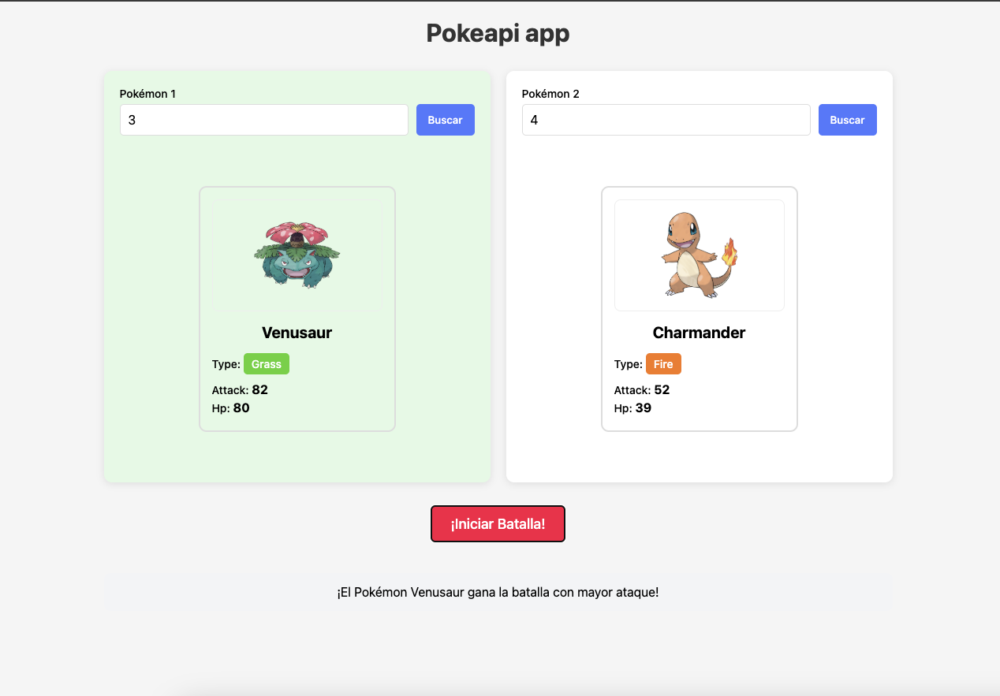

#   PokeAPI App

https://yunagosh7.github.io/pokeapi-example/

---

##   Estructura del archivo `.js`

1.  **Estado global**
    Variables que se usan durante todo el ciclo de vida de la app (por ejemplo, los Pokémon seleccionados y elementos del DOM).  Este objeto (`pokemons`) actúa como una fuente central de datos que se actualiza y se utiliza para renderizar la interfaz.

2.  **Utilidades**
    Funciones pequeñas que cumplen tareas específicas comunes adentro de un proyecto, son reutilizables y permiten evitar la repetición del código (como capitalizar texto, parsear fechas, buscar una propiedad adentro de un objeto, un elemento adentro de un array, etc).

3.  **Renderizado de UI**
    Funciones que modifican el DOM para mostrar los datos en pantalla (renderizado de tarjetas, resultados de la batalla, etc).

4.  **Validaciones y lógica de batalla**
    Validación de campos antes de iniciar una batalla y lógica para determinar el ganador según el ataque de cada Pokémon.

5.  **Peticiones HTTP y Adaptadores**
    Funciones que se comunican con la API y "adapters" que transforman los datos de la API al formato que utiliza la aplicación internamente.

6.  **Eventos del DOM**
    Event listeners que capturan interacciones del usuario (como hacer clic en “Buscar” o “Batallar”) y ejecutan funciones.
